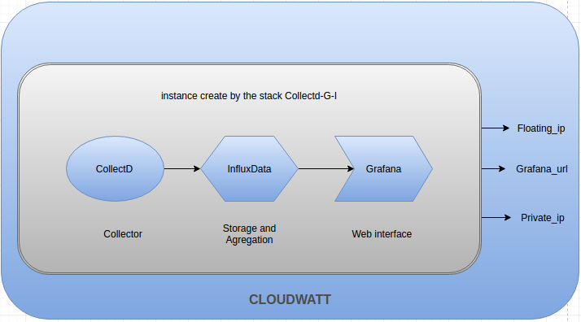

# 5 Minutes Stacks, épisode XX : Collectd-G-I (Collectd-Influxdb-Gafana)  #

## Episode XX :  Collectd-G-I (Collectd-Influxdb-Gafana)

Ecrit en 2005 par Florian Forster et développé en tant que projet open-source libre, Collectd est un démon Unix qui collecte les métriques envoyer par les capteurs de la machine locale ou de machine distante. les données récoltées sont transférées sur le backends un base de données à serie temporelle.

InfluxData est un solution de collection, de stockage, de visualisialisation, d'alerte et d'analyse en temps réel sur les séries temporelles de données émis par ces capteurs placés sur la machine locale et des machines distantes. C'est un outils de base de donnnées de serie temporelles utilisé en soutien au applications en développement, les services et les architectures à qui il est relié.
(Une série temporelle est une série de points qui représente une série de mesures identifiées par l’instant auquel elles ont été prises, notamment grâce au timestamp.)

Grafana est une interface graphique qui supporte de nombreux backends de stockage différents pour vos données de séries chronologiques
Les datasources suivants sont officiellement supportés : Graphite , InfluxDB , OpenTSDB et KairosDB. Vous pouvez combiner des données provenant de sources de données multiples sur un seul tableau de bord. c'est un interface graphique permettant de créer des graph.

Les trois solutions combinées forme ensemble un solution de monitoring efficiante estinée à aider les administrateurs système à maintenir une vue d' ensemble sur les ressources disponibles pour détecter les goulets d'étranglement existants ou imminents.

## Descriptions

La stack "Collectd-G-I" crée une instance, provisionées avec les services Collectd, Influxdata et Grafana. elle permet de visualiser les métriques via l'interface graphique Grafana sur n'importe quel navigateur web.

## Preparations

### Les versions
 - InfluxDB 0.13.0
 - Collectd 5.4.0
 - Grafana v3.1.1

### Les pré-requis pour déployer cette stack
Ceci devrait être une routine à présent:

* Un accès internet
* Un shell linux
* Un [compte Cloudwatt](https://www.cloudwatt.com/cockpit/#/create-contact) avec une [ paire de clés existante](https://console.cloudwatt.com/project/access_and_security/?tab=access_security_tabs__keypairs_tab)
* Les outils [OpenStack CLI](http://docs.openstack.org/cli-reference/content/install_clients.html)
* Un clone local du dépôt git [Cloudwatt applications](https://github.com/cloudwatt/applications)

### Taille de l'instance
Par défaut, le script propose un déploiement sur une instance de type "Standard" (n1.cw.standard-2). Il
existe une variété d'autres types d'instances pour la satisfaction de vos multiples besoins. Les instances sont facturées à la minute, vous permettant de payer uniquement pour les services que vous avez consommés et plafonnées à leur prix mensuel (vous trouverez plus de détails sur la [Page tarifs](https://www.cloudwatt.com/fr/produits/tarifs.html) du site de Cloudwatt).

Vous pouvez ajuster les paramètres de la stack à votre goût.

## Tour du propriétaire

Une fois le dépôt cloné, vous trouverez le répertoire `bundle-trusty-collectd-G-I/`

* `Collectdfr1.heat.yml` et `Collectdfr2.heat.yml`: Template d'orchestration HEAT, qui serviront à déployer l'infrastructure nécessaire fr1 et fr2 respectivement.
* `stack-start.sh`: Scipt de lancement de la stack, qui simplifie la saisie des paramètres et sécurise la création du mot de passe admin.

## Démarrage

### Initialiser l'environnement

Munissez-vous de vos identifiants Cloudwatt, et cliquez [ICI](https://console.cloudwatt.com/project/access_and_security/api_access/openrc/).
Si vous n'êtes pas connecté, vous passerez par l'écran d'authentification, puis le téléchargement d'un script démarrera. C'est grâce à celui-ci que vous pourrez initialiser les accès shell aux API Cloudwatt.

Sourcez le fichier téléchargé dans votre shell et entrez votre mot de passe lorsque vous êtes invité à utiliser les clients OpenStack.

~~~ bash
$ source COMPUTE-[...]-openrc.sh
Please enter your OpenStack Password:

~~~

Une fois ceci fait, les outils en ligne de commande d'OpenStack peuvent interagir avec votre compte Cloudwatt.

### Ajuster les paramètres

Dans le fichier `CollectdfrX.heat.yml` vous trouverez en haut une section `parameters`. Les parametres a remplir sont:

* bundle-trusty-collectd-G-I

  - `keypair_name` Le nom de votre clé privée.
  - `flavor_name` La taille de l'instance.(valeur par defaut: n1.cw.standard-1 sur fr1 et n2.cw.standard-1 sur fr2)
  - `collectd_passwd` le mot de passe pour la connection chiffrée entre les clients collectd et le server (par default le mot de passe est `my_password`)

~~~ yaml
heat_template_version: 2013-05-23

description: HOT template to deploy a Collectd-Influxdb-Gafana stack

parameters:

  key_name:
    description: Keypair to inject in instance
    label: SSH Keypair
    type: string
    default: mickael

  flavor:
    default: n1.cw.standard-2
    description: Flavor to use for the deployed instance
    type: string
    label: Instance Type (Flavor)
    constraints:
      - allowed_values:
        - t1.cw.tiny
        - s1.cw.small-1
        - n1.cw.standard-1
        - n1.cw.standard-2
        - n1.cw.standard-4
        - n1.cw.standard-8

  collectd_passwd:
    default: my_password
    description: passwd connexion between collectd client and server
    type: string
    hidden: true
[...]
~~~

Par défaut, les ports utilisés par la suites ne sont accessibles que sur le réseau local, si vous souhaitez changer ces règles de filtrage (pour ouvrir par exemple le port 3000 pour l'interface grafana), vous pouvez également éditer le fichier `collectfrX.heat.yml`.

~~~ yaml
security_group:
  type: OS::Neutron::SecurityGroup
  properties:
    rules:
      - { direction: ingress, protocol: TCP, port_range_min: 22, port_range_max: 22 }
      - { direction: ingress, protocol: TCP, port_range_min: 443, port_range_max: 443 }
      - { direction: ingress, protocol: TCP, port_range_min: 3000, port_range_max: 3000 }
      - { direction: egress, protocol: TCP, port_range_min: 3000, port_range_max: 3000 }
      - { direction: egress, protocol: TCP, port_range_min: 8086, port_range_max: 8086 }
      - { direction: ingress, protocol: TCP, port_range_min: 8086, port_range_max: 8086 }
      - { direction: egress, protocol: TCP, port_range_min: 25826, port_range_max: 25826 }
      - { direction: ingress, protocol: TCP, port_range_min: 25826, port_range_max: 25826 }
      - { direction: ingress, protocol: ICMP }
      - { direction: egress, protocol: ICMP }
      - { direction: egress, protocol: TCP }
      - { direction: egress, protocol: UDP }

~~~

### Démarrer la stack

Dans un shell, lancer le script `stack-start.sh`:

~~~
./stack-start.sh nom\_de\_votre\_stack
~~~

Exemple :

~~~bash
$ ./stack-start.sh vpn
+--------------------------------------+-----------------+--------------------+----------------------+
| id                                   | stack_name      | stack_status       | creation_time        |
+--------------------------------------+-----------------+--------------------+----------------------+
| ee873a3a-a306-4127-8647-4bc80469cec4 | Collectd-G-I    | CREATE_IN_PROGRESS | 2015-11-25T11:03:51Z |
+--------------------------------------+-----------------+--------------------+----------------------+
~~~

Puis attendez **5 minutes** que le déploiement soit complet.

 ~~~ bash
 $ watch -n 1 heat stack-list
 +--------------------------------------+-------------+-----------------+----------------------+
 | id                                   | stack_name  | stack_status    | creation_time        |
 +--------------------------------------+-------------+-----------------+----------------------+
 | xixixx-xixxi-ixixi-xiixxxi-ixxxixixi | Collectd-G-I| CREATE_COMPLETE | 2025-10-23T07:27:69Z |
 +--------------------------------------+-------------+-----------------+----------------------+
 ~~~
 ### C’est bien tout ça, mais vous n’auriez pas un moyen de lancer l’application par la console ?

 Et bien si ! En utilisant la console, vous pouvez déployer un serveur Vpn :

 1. Allez sur le Github Cloudwatt dans le répertoire applications/bundle-trusty-collectd-G-I/bundle-trusty-collectdGfr1/output
 2. Cliquez sur le fichier nommé CollectdfrX.heat.yml
 3. Cliquez sur RAW, une page web apparait avec le détail du script
 4. Enregistrez-sous le contenu sur votre PC dans un fichier avec le nom proposé par votre navigateur (enlever le .txt à la fin)
 5. Rendez-vous à la section « Stacks » de la console.
 6. Cliquez sur « Lancer la stack », puis cliquez sur « le fichier du modèle » et sélectionnez le fichier que vous venez de sauvegarder sur votre PC, puis cliquez sur « SUIVANT »
 7. Donnez un nom à votre stack dans le champ « Nom de la stack »
 8. Entrez votre keypair dans le champ « keypair_name »
 9. Entrez votre password dans le champ « collectd_passwd »
 10. Choisissez la taille de votre instance parmi le menu déroulant « flavor_name » et cliquez sur « LANCER »
 11. Une fois que la stack est crée, vous pouvez acces à ses `output`. Vous avez à récupérer la sortie de `floating_ip_server`, `server_private_ip`, `collectd_passwd` et `floating_ip_url`  
 12. Le votre solution de monitoring et montée, rendez vous sur l'url les identifants de connexion sont par default admin/admin.
 13. puis pour creer un nouveau graph cliquez sur dashboard, cliquez sur new, cliquez sur graph selectionez influx comme datasource puis enfin créez des requêtes.
 14. Les plugin activé par default sont:

  - cpu_value
  - df_value
  - disk_read
  - disk_write
  - entropy_value
  - interface_rx
  - interface_tx
  - load_longterm
  - load_midterm
  - load_shortterm
  - memory_value
  - process_value
  - swap_value
  - users_value

 

Le script `start-stack.sh` s'occupe de lancer les appels nécessaires sur les API Cloudwatt pour :

* Démarrer 1 instance basée sur Ubnuntu une pré-provisionnée avec la stack Collectd-Influxdb-Gafana.
* Configurer deux noeuds les services.

### Enjoy

Une fois tout ceci fait vous avez une solution de monitoring prêtte à être utilisée, vous pouvez récupérer les IP(publics et privées), sous réseaux, réseaux, associées aux instances créées grâce à la commande suivante (la section `outputs` liste les outputs de la stack) :

Vous aurez la possibilité de composer vos graphs de relever et de visualiser vos metriques sur un navigateur Web.

Vous pouvez visualiser les parametres de sortie de la stack dans la console
en cliquant sur : Stack → le nom de votre stack → l'onglet vue d'ensemble

Les outputs de la stack  sont :

- Floating_ip_server ( Ip publique  associatée au Server )
- Collectd_passwd ( password pour la connexion chiffrée entre les clients Collectd et le server )
- Server_private_ip ( Adresse ip Privée du  Server )
- floating_ip_url ( l'url du serveur grafana)

~~~ bash
$ heat stack-show Collectd-G-I
+-----------------------+---------------------------------------------------+
| Property              | Value                                             |
+-----------------------+---------------------------------------------------+
|                     [...]                                                 |
| outputs               | [                                                 |
|                       |   {                                               |
|                       |     "output_value": "Y.Y.Y.Y",                    |
|                       |     "description": "server private IP address",   |
|                       |     "output_key": "server_private_ip"             |
|                       |   },                                              |
|                       |   {                                               |
|                       |     "output_value": "X.X.X.X",                    |
|                       |     "description": "server1 public IP address",   |
|                       |     "output_key": "server1_public_ip"             |
|                       |   },                                              |
|                       |   {                                               |
|                       |     "output_value": "https://X.X.X.X:3000",       |
|                       |     "description": "floating_ip_url de grafana",  |
|                       |     "output_key": "floating_ip_url"               |
|                       |   },                                              |
|                       |   {                                               |
|                       |     "output_value": "my_password",                |
|                       |     "description": "collectd passwd",             |
|                       |     "output_key": "collectd_passwd"               |
|                       |   },                                              |                       
|                       | ]                                                 |
|                       |    [...]                                          |
+-----------------------+---------------------------------------------------+
~~~

### Administer le serveur  

~~~ bash
ssh -i <keypair> cloud@<node-ip@>

~~~

### Consulter les logs

Les logs des services sont visibles via ligne de commande

~~~ bash
ssh -i <keypair> cloud@<node-ip@>

~~~

Les services sauvegardent ses logs dans les fichiers `/var/log/syslog`, `/var/log/grafana.grafana.log`, `/var/log/influxdb/influxdb.log` et `/var/log/collectd.log`

~~~ bash
ssh -i <keypair> cloud@<node-ip@>
tail -n 100 /var/log/syslog
grep collectd /var/log/syslog
~~~

### Les fichiers importants sont :

fichier de configuration influxdb: `/etc/influxdb/influxdb.conf`
fichier de configuration collectd: `/etc/collectd/collectd.conf`
fichier de configuration grafana: `/etc/grafana/grafana.ini`
fichier de logs influxdb: `/var/log/influxdb/influxdb.log`
fichier de logs collectd: `/var/log/collectd.log`
fichier de logs grafana: `/var/log/grafana.grafana.log`

#### Autres sources pouvant vous intéresser:

* [Collectd Homepage](https://collectd.org/wiki/index.php/Main_Page)
* [Influxdata Homepage](https://influxdata.com/)
* [Grafana Homepage](http://grafana.org/)

-----
Have fun. Hack in peace.
