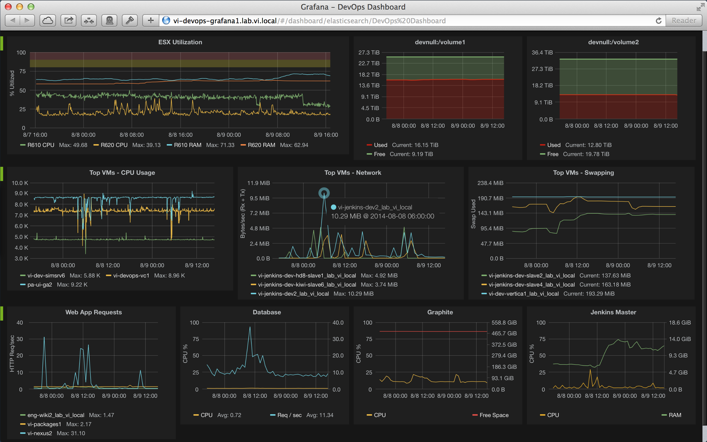

# 5 Minutes Stacks, épisode XX : Collectd-G-I (Collectd-Influxdb-Gafana)  #

## Episode XX :  Collectd-G-I (Collectd-Influxdb-Gafana)

Written in 2005 by Florian Forster and developed as project free open-source, Collectd is a demon Unix which collects the metrics to send by the sensors of the local machine or the distant machines. The collected datas are transferred on the backends a temporal series database.

InfluxData is a solution of collection, storage, of visualisialisation, alert and real time analysis on the temporal series of data emitted by these sensors placed on the local machine and the distant machines. It is a basic tools of donnnées of series temporal used in support in applications in development, the services and architectures with whom it is connected.
( A temporal series is a series of points which represents a series of measures identified by the moment with which they were taken, in particular thanks to the timestamp.)

Grafana is a graphical interface which supports of numerous backends of storage different for your data of chronological series. The following datasources  officially support: graphite, InfluxDB, OpenTSDB and KairosDB.
You can combine data resulting from sources of multiple data on a single dashboard. It is a graphical interface allowing to create graph.

Three combined solutions shape together one solution of monitoring efficiante estinée to help the administrators system to maintain a view of set on the available resources to detect the existing or imminent bottlenecks.

## Descriptions

The stack " Collectd-G-I " creates an authority, pre-configurate with the services Collectd, Influxdata and Grafana. it allows to display the metrics via the graphical interface Grafana on any Web browser.

## Preparations

### The features
 - InfluxDB 0.13.0
 - Collectd 5.4.0
 - Grafana v3.1.1

### The prerequisites to deploy this stack

  * an internet access
  * a Linux shell
  * a [Cloudwatt account](https://www.cloudwatt.com/cockpit/#/create-contact), with an [existing keypair](https://console.cloudwatt.com/project/access_and_security/?tab=access_security_tabs__keypairs_tab)
  * the tools [OpenStack CLI](http://docs.openstack.org/cli-reference/content/install_clients.html)
  * a local clone of the git repository [Cloudwatt applications](https://github.com/cloudwatt/applications)

### Size of the instance

  Per default, the script is proposing a deployement on an instance type "Standard 2" (n2.cw.standard-2).  Instances are charged by the minute and capped at their monthly price (you can find more details on the [Tarifs page](https://www.cloudwatt.com/fr/produits/tarifs.html) on the Cloudwatt website). Obviously.

  You can adjust the stack parameters, particularly its defaut size.

## Tour du propriétaire

Once the repository cloned, you will find the folder
 `bundle-trusty-collectd-G-I/`

* `Collectdfr1.heat.yml` and `Collectdfr2.heat.yml`: Template orchestration HOT, which will be use to deploy the stack
* `stack-start.sh`: Scipt de lancement de la stack, qui simplifie la saisie des paramètres et sécurise la création du mot de passe admin.

## Start-up

### Initialize the environment

Stack launching script. This is a small script that will save you some copy-paste.

Have your Cloudwatt credentials in hand and click [HERE](https://console.cloudwatt.com/project/access_and_security/api_access/openrc/).
If you are not logged in yet, you will go thru the authentication screen then the script download will start. Thanks to it, you will be able to initiate the shell accesses towards the Cloudwatt APIs.

Source the downloaded file in your shell. Your password will be requested.

~~~ bash
$ source COMPUTE-[...]-openrc.sh
Please enter your OpenStack Password:

~~~

Once this done, the Openstack command line tools can interact with your Cloudwatt user account.

### Adjust the parameters

In the file  `CollectdfrX.heat.yml` you will find at the top the field `parameters`. Les parametres a remplir sont:

* bundle-trusty-collectd-G-I

  - `keypair_name` name of your private key.
  - `flavor_name` the size of you instance (the default values are n1.cw.standard-1 on fr1 and n2.cw.standard-1 on fr2)
  - `collectd_passwd` the password chosen for the communication between the client(s) and the server (the default password is `my_password`)

~~~ yaml
heat_template_version: 2013-05-23

description: HOT template to deploy a Collectd-Influxdb-Gafana stack

parameters:

  key_name:
    description: Keypair to inject in instance
    label: SSH Keypair
    type: string
    default: mickael

  flavor:
    default: n1.cw.standard-2
    description: Flavor to use for the deployed instance
    type: string
    label: Instance Type (Flavor)
    constraints:
      - allowed_values:
        - t1.cw.tiny
        - s1.cw.small-1
        - n1.cw.standard-1
        - n1.cw.standard-2
        - n1.cw.standard-4
        - n1.cw.standard-8

  collectd_passwd:
    default: my_password
    description: passwd connexion between collectd client and server
    type: string
    hidden: true
[...]
~~~

By default, ports used by consequences are accessible only on the local area network, if you wish to change these rules of filtering (to open for example the port 3000 for the interface grafana), you can also publish the file `collectfrX.heat.yml `.

~~~ yaml
security_group:
  type: OS::Neutron::SecurityGroup
  properties:
    rules:
      - { direction: ingress, protocol: TCP, port_range_min: 22, port_range_max: 22 }
      - { direction: ingress, protocol: TCP, port_range_min: 443, port_range_max: 443 }
      - { direction: ingress, protocol: TCP, port_range_min: 3000, port_range_max: 3000 }
      - { direction: egress, protocol: TCP, port_range_min: 3000, port_range_max: 3000 }
      - { direction: egress, protocol: TCP, port_range_min: 8086, port_range_max: 8086 }
      - { direction: ingress, protocol: TCP, port_range_min: 8086, port_range_max: 8086 }
      - { direction: egress, protocol: TCP, port_range_min: 25826, port_range_max: 25826 }
      - { direction: ingress, protocol: TCP, port_range_min: 25826, port_range_max: 25826 }
      - { direction: ingress, protocol: ICMP }
      - { direction: egress, protocol: ICMP }
      - { direction: egress, protocol: TCP }
      - { direction: egress, protocol: UDP }

~~~

### Démarrer la stack

In a shell, launch the script `stack-start.sh`:

~~~
./stack-start.sh nom\_de\_votre\_stack
~~~

Example :

~~~bash
$ ./stack-start.sh vpn
+--------------------------------------+-----------------+--------------------+----------------------+
| id                                   | stack_name      | stack_status       | creation_time        |
+--------------------------------------+-----------------+--------------------+----------------------+
| ee873a3a-a306-4127-8647-4bc80469cec4 | Collectd-G-I    | CREATE_IN_PROGRESS | 2015-11-25T11:03:51Z |
+--------------------------------------+-----------------+--------------------+----------------------+
~~~

Then wait for **5 minutes** than the deplyemnent been completed.

 ~~~ bash
 $ watch -n 1 heat stack-list
 +--------------------------------------+-------------+-----------------+----------------------+
 | id                                   | stack_name  | stack_status    | creation_time        |
 +--------------------------------------+-------------+-----------------+----------------------+
 | xixixx-xixxi-ixixi-xiixxxi-ixxxixixi | Collectd-G-I| CREATE_COMPLETE | 2025-10-23T07:27:69Z |
 +--------------------------------------+-------------+-----------------+----------------------+
 ~~~
 ### C’est bien tout ça, mais vous n’auriez pas un moyen de lancer l’application par la console ?

 Et bien si ! En utilisant la console, vous pouvez déployer un serveur Vpn :
 1.	Go the Cloudwatt Github in the applications/bundle-trusty-collectd-G-I/bundle-trusty-collectdGfr1/output repository
 2.	Click on the file called CollectdfrX.heat.yml
 3.	Click on RAW, a web page appear with the script details
 4.	Save as its content on your PC. You can use the default name proposed by your browser (just remove the .txt)
 5.  Go to the « [Stacks](https://console.cloudwatt.com/project/stacks/) » section of the console
 6.	Click on « Launch stack », then click on « Template file » and select the file you've just saved on your PC, then click on « NEXT »
 7.	Named your stack in the « Stack name » field
 8.	Complete the parameters fields
 8. Enter your keypair into the field « keypair_name »
 9. Enter your password into the field « collectd_passwd »
 10. Choose the size of you instance in the field  « flavor_name » and click on « launh »
 11. Once the stack created, you can access to its `output`. you can get the `floating_ip_server`, the `server_private_ip`, the `collectd_passwd` and the `floating_ip_url`  
 12. Your solution of monitoring is set up, go on the output url (the identifants of connection are by default admin / admin).
 13. Then to create a graph new click dashboard, click on new, click graph selectionez impulse as datasource then finally create queries.
 14. Plugin activated by default is:

  - cpu_value
  - df_value
  - disk_read
  - disk_write
  - entropy_value
  - interface_rx
  - interface_tx
  - load_longterm
  - load_midterm
  - load_shortterm
  - memory_value
  - process_value
  - swap_value
  - users_value

 

 The script `start-stack.sh ` takes care with issuing the necessary appeals on the API Cloudwatt for:

 * Start 1 authority based on Ubnuntu one pre-funded with the stack Collectd-Influxdb-Gafana.
 * Pre-Configure the services.

### Enjoy

Once all this makes you have a solution of monitoring prêtte to be used, you can get back the IP (public and private), under networks, networks, associated with the authorities created thanks to the following command (the section `outputs ` list the outputs of the stack):

You will have the possibility of composing your graphs to display your metrics on a Web browser.

You can display the output's parameters of the stack in the console by clicking on: Stack -> The name of your stack -> The tab overview

The outputs of the stack are:

- Floating_ip_server (public associatée Ip in Server)
- Collectd_passwd (password for the connection private between the customers Collectd and the server)
- Server_private_ip (Send private ip of Server)
- Floating_ip_url

~~~ bash
$ heat stack-show Collectd-G-I
+-----------------------+---------------------------------------------------+
| Property              | Value                                             |
+-----------------------+---------------------------------------------------+
|                     [...]                                                 |
| outputs               | [                                                 |
|                       |   {                                               |
|                       |     "output_value": "Y.Y.Y.Y",                    |
|                       |     "description": "server private IP address",   |
|                       |     "output_key": "server_private_ip"             |
|                       |   },                                              |
|                       |   {                                               |
|                       |     "output_value": "X.X.X.X",                    |
|                       |     "description": "server1 public IP address",   |
|                       |     "output_key": "server1_public_ip"             |
|                       |   },                                              |
|                       |   {                                               |
|                       |     "output_value": "https://X.X.X.X:3000",       |
|                       |     "description": "grafana floating_ip_url",     |
|                       |     "output_key": "floating_ip_url"               |
|                       |   },                                              |
|                       |   {                                               |
|                       |     "output_value": "my_password",                |
|                       |     "description": "collectd passwd",             |
|                       |     "output_key": "collectd_passwd"               |
|                       |   },                                              |                   |                       | ]                                                 |
|                       |    [...]                                          |
+-----------------------+---------------------------------------------------+
~~~

### Adminiting the server  

~~~ bash
ssh -i <keypair> cloud@<node-ip@>

~~~

### Consult the logs

the logs files of the services are:

~~~ bash
ssh -i <keypair> cloud@<node-ip@>

~~~

the services save their logs into the following files `/var/log/syslog`, `/var/log/grafana.grafana.log`, `/var/log/influxdb/influxdb.log` et `/var/log/collectd.log`

~~~ bash
ssh -i <keypair> cloud@<node-ip@>
tail -n 100 /var/log/syslog
grep collectd /var/log/syslog
~~~

### The importants files are :

 - Configuration's file influxdb: `/etc/influxdb/influxdb.conf`
 - Configuration's file collectd: `/etc/collectd/collectd.conf`
 - Configuration's file grafana: `/etc/grafana/grafana.ini`
 - Logs's file influxdb: `/var/log/influxdb/influxdb.log`
 - Logs's file collectd: `/var/log/collectd.log`
 - Logs's file grafana: `/var/log/grafana.grafana.log`

#### other sources which could possibly be interesting :

* [Collectd Homepage](https://collectd.org/wiki/index.php/Main_Page)
* [Influxdata Homepage](https://influxdata.com/)
* [Grafana Homepage](http://grafana.org/)

-----
Have fun. Hack in peace.
