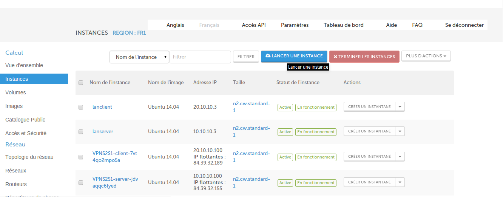
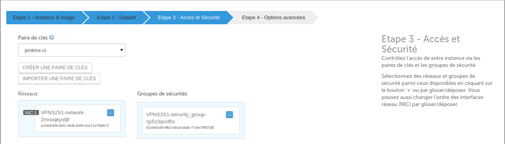
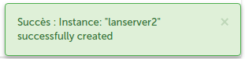

# 5 Minutes Stacks, épisode XX : OpenVPN (site-to-site)  #

## Episode XX : OpenVPN (site-to-site)

Créé en 2002, Open est un outil open source utilisé pour construire des VPNs site à site avec le protocole SSL/TLS ou avec des clefs partagées. Son rôle est de "tunneliser", de manière sécurisée, des données sur un seul port TCP/UDP à travers un réseau non sûr comme Internet et ainsi établir des VPNs.
OpenVPN peut être installé sur presque toutes les plateformes comme Linux, Microsoft Windows 2000/XP/Vista, OpenBSD, FreeBSD, NetBSD, Mac OS X et Solaris.
Les systèmes Linux doivent avoir un noyau 2.4 ou supérieur. Le principe de configuration reste le même quel que soit la plate-forme utilisée.
OpenVPN crée un tunnel TCP ou UDP et ensuite chiffre les données à l'intérieur de celui-ci.
Le port par défaut utilisé par OpenVPN est le port UDP 1194, basé sur un assignement officiel de port par l'IANA.

## Descriptions

La stack "vpn(site-to-site)"" crée deux instance, un client VPN et un serveur VPN puis monte un tunnel vpn entre ces deux noeuds.

## Preparations

### Les versions
 - OpenVPN 2.3.2-7ubuntu3.1

### Les pré-requis pour déployer cette stack
Ceci devrait être une routine à présent:

* Un accès internet
* Un shell linux
* Un [compte Cloudwatt](https://www.cloudwatt.com/cockpit/#/create-contact) avec une [ paire de clés existante](https://console.cloudwatt.com/project/access_and_security/?tab=access_security_tabs__keypairs_tab)
* Les outils [OpenStack CLI](http://docs.openstack.org/cli-reference/content/install_clients.html)
* Un clone local du dépôt git [Cloudwatt applications](https://github.com/cloudwatt/applications)

### Taille de l'instance
Par défaut, le script propose un déploiement sur une instance de type "Standard" (n2.cw.standard-2). Il
existe une variété d'autres types d'instances pour la satisfaction de vos multiples besoins. Les instances sont facturées à la minute, vous permettant de payer uniquement pour les services que vous avez consommés et plafonnées à leur prix mensuel (vous trouverez plus de détails sur la [Page tarifs](https://www.cloudwatt.com/fr/produits/tarifs.html) du site de Cloudwatt).

Vous pouvez ajuster les paramètres de la stack à votre goût.

## Tour du propriétaire

Une fois le dépôt cloné, vous trouverez le répertoire `bundle-coreos-cassandra/`

* `bundle-trusty-vpn.heat.yml`: Template d'orchestration HEAT, qui servira à déployer l'infrastructure nécessaire.
* `stack-start.sh`: Scipt de lancement de la stack, qui simplifie la saisie des paramètres et sécurise la création du mot de passe admin.

## Démarrage

### Initialiser l'environnement

Munissez-vous de vos identifiants Cloudwatt, et cliquez [ICI](https://console.cloudwatt.com/project/access_and_security/api_access/openrc/).
Si vous n'êtes pas connecté, vous passerez par l'écran d'authentification, puis le téléchargement d'un script démarrera. C'est grâce à celui-ci que vous pourrez initialiser les accès shell aux API Cloudwatt.

Sourcez le fichier téléchargé dans votre shell et entrez votre mot de passe lorsque vous êtes invité à utiliser les clients OpenStack.

~~~ bash
$ source COMPUTE-[...]-openrc.sh
Please enter your OpenStack Password:

~~~

Une fois ceci fait, les outils en ligne de commande d'OpenStack peuvent interagir avec votre compte Cloudwatt.

### Ajuster les paramètres

Dans le fichier `bundle-trusty-vpn.heat.yml` vous trouverez en haut une section `parameters`. Le seul paramètre obligatoire à ajuster
est celui nommé `keypair_name` dont la valeur `default` doit contenir le nom d'une paire de clés valide dans votre compte utilisateur.
C'est dans ce même fichier que vous pouvez ajuster la taille de l'instance par le paramètre `flavor_name`.

~~~ yaml
heat_template_version: 2013-05-23

description: Virtual Private Network Stack Site to Site

parameters:

  server_cidr:
    description: /24 cidr of local subnet
    type: string

  client_cidr:
    description: /24 cidr of target subnet (other end of the tunnel)
    type: string

  COUNTRY:
    description: COUNTRY for the VPN certificate
    label: certificate VPN COUNTRY
    type: string
    hidden: true
    constraints:
      - length: { min: 1, max: 2 }
        description: COUNTRY must be between 1 and 2 characters

  PROVINCE:
    description: PROVINCE for the VPN certificate
    label: certificate VPN PROVINCE
    type: string
    hidden: true
    constraints:
      - length: { min: 1, max: 40 }
        description: PROVINCE must be between 1 and 40 characters

  CITY:
    description: CITY for the VPN certificate
    label: certificate VPN CITY
    type: string
    hidden: true
    constraints:
      - length: { min: 1, max: 40 }
        description: CITY must be between 1 and 40 characters

  ORGANISATION:
    description: ORGANISATION for the VPN certificate
    label: certificate VPN ORGANISATION
    type: string
    hidden: true
    constraints:
      - length: { min: 1, max: 40 }
        description: ORGANISATION must be between 1 and 40 characters

  EMAIL:
    description: EMAIL for the VPN certificate
    label: certificate VPN EMAIL
    type: string
    hidden: true
    constraints:
      - length: { min: 1, max: 40 }
        description:  EMAIL must be between 1 and 40 characters

  image:
    type: string
    description: Glance Image
    default: "Ubuntu 14.04"

  keypair_name:
    description: Keypair to inject in instance
    label: SSH Keypair
    type: string

  flavor_name:
    default: n2.cw.standard-1
    description: Flavor to use for the deployed instance
    type: string
    label: Instance Type (Flavor)
    constraints:
      - allowed_values:
        - t1.cw.tiny
        - s1.cw.small-1
        - n2.cw.standard-1
        - n2.cw.standard-2
        - n2.cw.standard-4
        - n2.cw.standard-8
        - n2.cw.standard-16
        - n2.cw.highmem-2
        - n2.cw.highmem-4
        - n2.cw.highmem-8
        - n2.cw.highmem-12
[...]
~~~

Par défaut, les ports utilisés par OpenVPN ne sont accessibles que sur le réseau local, si vous souhaitez changer ces règles de filtrage (pour ouvrir par exemple le port 1194), vous pouvez également éditer le fichier `bundle-trusty-vpn.heat.yml`.

~~~ yaml
security_group:
  type: OS::Neutron::SecurityGroup
  properties:
    rules:
      - { direction: ingress, protocol: TCP, port_range_min: 22, port_range_max: 22 }
      - { direction: ingress, protocol: TCP, port_range_min: 80, port_range_max: 80 }
      - { direction: ingress, protocol: TCP, port_range_min: 443, port_range_max: 443 }
      - { direction: ingress, protocol: UDP, port_range_min: 1194, port_range_max: 1194 }
      - { direction: ingress, protocol: ICMP }
      - { direction: egress, protocol: ICMP }
      - { direction: egress, protocol: TCP }
      - { direction: egress, protocol: UDP }
      - { direction: egress, protocol: UDP, port_range_min: 1194, port_range_max: 1194 }
~~~

### Démarrer la stack

Dans un shell, lancer le script `stack-start.sh`:

~~~
./stack-start.sh nom\_de\_votre\_stack
~~~

Exemple :

~~~bash
$ ./stack-start.sh vpn
+--------------------------------------+-----------------+--------------------+----------------------+
| id                                   | stack_name      | stack_status       | creation_time        |
+--------------------------------------+-----------------+--------------------+----------------------+
| ee873a3a-a306-4127-8647-4bc80469cec4 | VPN       | CREATE_IN_PROGRESS | 2015-11-25T11:03:51Z |
+--------------------------------------+-----------------+--------------------+----------------------+
~~~

Puis attendez **5 minutes** que le déploiement soit complet.

 ~~~ bash
 $ watch -n 1 heat stack-list
 +--------------------------------------+------------+-----------------+----------------------+
 | id                                   | stack_name | stack_status    | creation_time        |
 +--------------------------------------+------------+-----------------+----------------------+
 | xixixx-xixxi-ixixi-xiixxxi-ixxxixixi | VPN  | CREATE_COMPLETE | 2025-10-23T07:27:69Z |
 +--------------------------------------+------------+-----------------+----------------------+
 ~~~
 ### C’est bien tout ça, mais vous n’auriez pas un moyen de lancer l’application par la console ?

 Et bien si ! En utilisant la console, vous pouvez déployer un serveur Vpn :

 1. Allez sur le Github Cloudwatt dans le répertoire applications/bundle-trusty-mean
 2. Cliquez sur le fichier nommé bundle-trusty-vpn.heat.yml
 3. Cliquez sur RAW, une page web apparait avec le détail du script
 4. Enregistrez-sous le contenu sur votre PC dans un fichier avec le nom proposé par votre navigateur (enlever le .txt à la fin)
 5. Rendez-vous à la section « Stacks » de la console.
 6. Cliquez sur « Lancer la stack », puis cliquez sur « le fichier du modèle » et sélectionnez le fichier que vous venez de sauvegarder sur votre PC, puis cliquez sur « SUIVANT »
 7. Donnez un nom à votre stack dans le champ « Nom de la stack »
 8. Entrez votre keypair dans le champ « keypair_name »
 9. Entrez les informations pour l'edition du certificat
 à savoir :
- ORGANISATION(entre 1 et 40 caractères)
- CITY(entre 1 et 40 caractères)
- PROVINCE(entre 1 et 40 caractères)
- EMAIL (entre 1 et 40 caractères)
- COUNTRY (entre 1 et 2 caractères)
 10.  Entrez les reseaux client et server que vous voulez parametrer en terminant par /24 :
 Client_cidr :  X.X.X.X/24
 Server_cidr : X.X.X.X/24
 11. Choisissez la taille de votre instance parmi le menu déroulant « flavor_name » et cliquez sur « LANCER »
 12. Connectez-vous sur le server et le client Openvpn via ssh en utilisant votre clé ssh avec la commande
 Ssh -i  votre_clé cloud@X.X.X.X (adresse ip de la machine que vous souhaitez joindre)

Le script `start-stack.sh` s'occupe de lancer les appels nécessaires sur les API Cloudwatt pour :

* démarrer 2 instances basées sur Ubnuntu, pré-provisionnée avec la stack OpenVPN.
* configurer deux noeuds un serveur OpenVPN et un client OpenVPN.
* monter le tunnel VPN entre ces deux noeuds.

### Enjoy

Une fois tout ceci fait vous avez tunnel VPN entre deux site distants prêt à être utilisé, vous pouvez récupérer les IP(publics et privées), sous réseaux, réseaux, associées aux instances créées grâce à la commande suivante (la section `outputs` liste les outputs de la stack) :

Vous aurez ainsi 2 silos réseau totalement isolés, qui peuvent néanmoins communiquer au travers d'un tunnel chiffré.

Vous pouvez visualiser les parametres de sortie de la stack dans la console
en cliquant sur : Stack → le nom de votre stack → l'onglet vue d'ensemble

Les outputs de la stack sont :

- server_id (id de l'instance serveur vpn )
- client_id (id de l'instance client vpn )
- floating_ip_server ( ip publique associée au serveur vpn )
- floating_ip_client( ip publique associée au client vpn )
- security_group_id ( id du groupe de securité )
- server_private_ip ( adresse ip privé du serveur vpn )
- client_private_ip ( adresse ip privé du client vpn )
- subnet_server_id ( id du sous reseau associé au serveur vpn )
- network_server_id ( id du reseau privé associé au serveur vpn )
- subnet_client_id ( id du sous reseau associé au client vpn )
- network_client_id ( id du reseau privé associé au client vpn )

~~~ bash
$ heat stack-show OpenVPN
+-----------------------+---------------------------------------------------+
| Property              | Value                                             |
+-----------------------+---------------------------------------------------+
|                     [...]                                                 |
| outputs               | [                                                 |
|                       |   {                                               |
|                       |     "output_value": "10.0.1.100",                 |
|                       |     "description": "server3 private IP address",  |
|                       |     "output_key": "server3_private_ip"            |
|                       |   },                                              |
|                       |   {                                               |
|                       |     "output_value": "10.0.1.102",                 |
|                       |     "description": "server1 private IP address",  |
|                       |     "output_key": "server1_private_ip"            |
|                       |   },                                              |
|                       |   {                                               |
|                       |     "output_value": "XX.XX.XX.XX",                |
|                       |     "description": "server3 public IP address",   |
|                       |     "output_key": "server3_public_ip"             |
|                       |   },                                              |
|                       |   {                                               |
|                       |     "output_value": "YY.YY.YY.YY",                |
|                       |     "description": "server1 public IP address",   |
|                       |     "output_key": "server1_public_ip"             |
|                       |   },                                              |
|                       |   {                                               |
|                       |     "output_value": "10.0.1.103",                 |
|                       |     "description": "server2 private IP address",  |
|                       |     "output_key": "server2_private_ip"            |
|                       |   },                                              |
|                       |   {                                               |
|                       |     "output_value": "ZZ.ZZ.ZZ.ZZ",                |
|                       |     "description": "server2 public IP address",   |
|                       |     "output_key": "server2_public_ip"             |
|                       |   }                                               |
|                       | ]                                                 |
|                     [...]                                                 |
+-----------------------+---------------------------------------------------+
~~~

### Administer le serveur  OpenVPN

~~~ bash
ssh -i <keypair> cloud@<node-ip@>

~~~

### Consulter les logs de OpenVPN

Les logs de services OpenVPN sont visibles via ligne de commande

~~~ bash
ssh -i <keypair> core@<node-ip@>

~~~

OpenVPN sauvegarde ses logs dans les fichiers `/var/log/syslog` et `/var/log/openvpn.log`

~~~ bash
ssh -i <keypair> cloud@<node-ip@>
tail -n 100 /var/log/openvpn.log
grep VPN /var/log/syslog
~~~

### Spawner des instances dans les sous-reseaux des noeuds client et serveur OpenVPN

Rendez-vous à la section « Stacks » de la console. Lancer la Stack «  bundle-trusty-vpn-spawn-server-s2s » pour créer du coté serveur et «  bundle-trusty-vpn-spawn-client-s2s » du coté client.

Afin de démarrer ces stacks vous devrez compléter les informations suivnantes :

go to the Instances section of the console and click on Start Instance.

Choisissez le nom, le nombre, the ficher de demarrage, et l'image de demarrage de votre instance.

Choisissez la taille de votre ou vos instance(s).

Selectionnez la clé le security group et le nom du subnet associé à l'instance.

Cliquez sur lancer pour démarrer l'instance

Cela signifie que votre à été crée avec succès.

Vous pouvez verifier votre nouvelle instance figure bien dans la liste des instances de votre tonent.

Connectez-vous sur les instances que vous venez de créer par ssh en depuis le serveur ou le client Openvpn grace à la clé my_key créée durant le montage de la stack Openvpn en appliquant l étape 12 du deploiement du vpn.

### Une fois sur le serveur ou le client Openvpn pour joindre les instances que vous venez de créer.

~~~ bash

cd /home/cloud/.ssh
ssh -i my_key3 cloud@<node-ip@>
~~~

### Les fichiers importants sont :

#### pour le server:

- `/etc/openvpn/ta.key`: clé secrète partagée entre le Client et le Serveur
- `/etc/openpvn/ca.crt`: Certificat d administration SSL/TLS
- `/etc/openvpn/server.key`:  clé du server
- `/etc/openvpn/server.crt`:  Certificat du server
- `/etc/openvpn/server.conf`: Fichier de configuration du server
- `/etc/openvpn/configclient.tar.gz`: Archive contenant les fichiers de configuration du client  OpenVPN

#### pour le client:

- `/etc/openvpn/ta.key`: clé secrète partagée entre le Client et le Serveur
- `/etc/openpvn/ca.crt`: Certificat d administration SSL/TLS
- `/etc/openvpn/client.key`:  clé du client
- `/etc/openvpn/client.crt`:  Certificat du client
- `/etc/openvpn/client.conf`: Fichier de configuration du client

#### Autres sources pouvant vous intéresser:

* [OpenVPN Homepage](https://openvpn.net/)
* [Ubuntu OpenVPN Homepage](https://doc.ubuntu-fr.org/openvpn)

-----
Have fun. Hack in peace.
