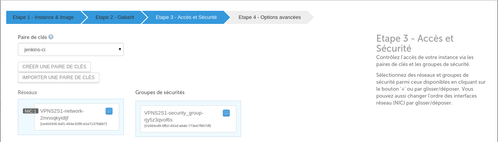
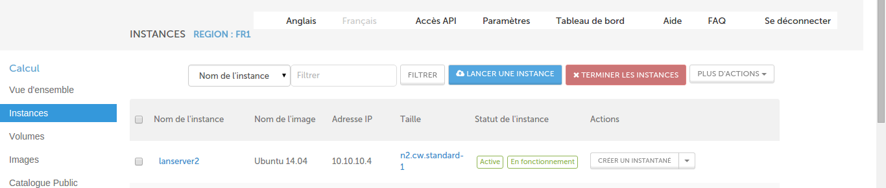

# 5 Minutes Stacks, épisode XX : OpenVPN (site-to-site)  #

## Episode XX : OpenVPN (site-to-site)

Created in 2002, Open is an open source tool used to build VPNs site with site with the protocol SSL / TLS or with the shared keys. His(her,its) role is "to tunneliser ", in a secure way, data on a single port(bearing) TCP / UDP through a network not safe(sure) as Internet and so to establish VPNs.
OpenVPN can be installed(settled) on almost all the platforms as Linux, Microsoft Windows 2000 / XP / Vista, OpenBSD, FreeBSD, NetBSD, Mac BONE X and Solaris.
The Linux systems have to have a pit(core) 2.4 or a superior(a higher education). The principle of configuration stays the same whatever is the used platform.
OpenVPN creates a tunnel TCP or UDP and then calculates(codes) the data inside this one.
The port(bearing) by default used by OpenVPN is the port(bearing) UDP 1194, based on an official assignement of port(bearing) by the IANA.

## Descriptions

La stack "vpn(site-to-site)"" create 2 instance, a OpenVPN client  et a OpenVPN serveur then install a vpn tunnel between those two nodes.

## Preparations

### the versions
 - OpenVPN 2.3.2-7ubuntu3.1

 ### The prerequisites to deploy this stack

  * an internet access
  * a Linux shell
  * a [Cloudwatt account](https://www.cloudwatt.com/cockpit/#/create-contact), with an [existing keypair](https://console.cloudwatt.com/project/access_and_security/?tab=access_security_tabs__keypairs_tab)
  * the tools [OpenStack CLI](http://docs.openstack.org/cli-reference/content/install_clients.html)
  * a local clone of the git repository [Cloudwatt applications](https://github.com/cloudwatt/applications)

 ### Size of the instance

  Per default, the script is proposing a deployement on an instance type "Standard 2" (n2.cw.standard-2).  Instances are charged by the minute and capped at their monthly price (you can find more details on the [Tarifs page](https://www.cloudwatt.com/fr/produits/tarifs.html) on the Cloudwatt website). Obviously, you can adjust the stack parameters, particularly its defaut size.

 ## What will you find in the repository

  Once you have cloned the github, you will find in the `bundle-coreos-cassandra/` repository:

  * `bundle-coreos-cassandra.heat.yml`: HEAT orchestration template. It will be used to deploy the necessary infrastructure.
  * `stack-start.sh`: Stack launching script. This is a small script that will save you some copy-paste.

 ## Start-up

 ### Initialize the environment

  Have your Cloudwatt credentials in hand and click [HERE](https://console.cloudwatt.com/project/access_and_security/api_access/openrc/).
  If you are not logged in yet, you will go thru the authentication screen then the script download will start. Thanks to it, you will be able to initiate the shell accesses towards the Cloudwatt APIs.

  Source the downloaded file in your shell. Your password will be requested.

  ~~~ bash
  $ source COMPUTE-[...]-openrc.sh
  Please enter your OpenStack Password:

  ~~~

  Once this done, the Openstack command line tools can interact with your Cloudwatt user account.

 ### Adjust the parameters

  With the `bundle-coreos-cassandra.heat.yml` file, you will find at the top a section named `parameters`. The sole mandatory parameter to adjust is the one called `keypair_name`. Its `default` value must contain a valid keypair with regards to your Cloudwatt user account. This is within this same file that you can adjust the instance size by playing with the `flavor_name` parameter.

~~~ yaml
heat_template_version: 2013-05-23

description: Virtual Private Network Stack Site to Site

parameters:

  server_cidr:
    description: /24 cidr of local subnet
    type: string

  client_cidr:
    description: /24 cidr of target subnet (other end of the tunnel)
    type: string

  COUNTRY:
    description: COUNTRY for the VPN certificate
    label: certificate VPN COUNTRY
    type: string
    hidden: true
    constraints:
      - length: { min: 1, max: 2 }
        description: COUNTRY must be between 1 and 2 characters

  PROVINCE:
    description: PROVINCE for the VPN certificate
    label: certificate VPN PROVINCE
    type: string
    hidden: true
    constraints:
      - length: { min: 1, max: 40 }
        description: PROVINCE must be between 1 and 40 characters

  CITY:
    description: CITY for the VPN certificate
    label: certificate VPN CITY
    type: string
    hidden: true
    constraints:
      - length: { min: 1, max: 40 }
        description: CITY must be between 1 and 40 characters

  ORGANISATION:
    description: ORGANISATION for the VPN certificate
    label: certificate VPN ORGANISATION
    type: string
    hidden: true
    constraints:
      - length: { min: 1, max: 40 }
        description: ORGANISATION must be between 1 and 40 characters

  EMAIL:
    description: EMAIL for the VPN certificate
    label: certificate VPN EMAIL
    type: string
    hidden: true
    constraints:
      - length: { min: 1, max: 40 }
        description:  EMAIL must be between 1 and 40 characters

  image:
    type: string
    description: Glance Image
    default: "Ubuntu 14.04"

  keypair_name:
    description: Keypair to inject in instance
    label: SSH Keypair
    type: string

  flavor_name:
    default: n2.cw.standard-1
    description: Flavor to use for the deployed instance
    type: string
    label: Instance Type (Flavor)
    constraints:
      - allowed_values:
        - t1.cw.tiny
        - s1.cw.small-1
        - n2.cw.standard-1
        - n2.cw.standard-2
        - n2.cw.standard-4
        - n2.cw.standard-8
        - n2.cw.standard-16
        - n2.cw.highmem-2
        - n2.cw.highmem-4
        - n2.cw.highmem-8
        - n2.cw.highmem-12
[...]
~~~

By default, ports(bearings) used by Openvpn are accessible only on the local area network, if you wish to change these rules of filtering (to open for example the port XXX), you can also edit the file `bundle-trusty-vpn.heat.yml `.
~~~ yaml
security_group:
  type: OS::Neutron::SecurityGroup
  properties:
    rules:
      - { direction: ingress, protocol: TCP, port_range_min: 22, port_range_max: 22 }
      - { direction: ingress, protocol: TCP, port_range_min: 80, port_range_max: 80 }
      - { direction: ingress, protocol: TCP, port_range_min: 443, port_range_max: 443 }
      - { direction: ingress, protocol: UDP, port_range_min: 1194, port_range_max: 1194 }
      - { direction: ingress, protocol: ICMP }
      - { direction: egress, protocol: ICMP }
      - { direction: egress, protocol: TCP }
      - { direction: egress, protocol: UDP }
      - { direction: egress, protocol: UDP, port_range_min: 1194, port_range_max: 1194 }
~~~

### Démarrer la stack

From a shell, launch the script `stack-start.sh`:

~~~
./stack-start.sh nom\_de\_votre\_stack
~~~

Example :

~~~bash
$ ./stack-start.sh vpn
+--------------------------------------+-----------------+--------------------+----------------------+
| id                                   | stack_name      | stack_status       | creation_time        |
+--------------------------------------+-----------------+--------------------+----------------------+
| ee873a3a-a306-4127-8647-4bc80469cec4 | VPN       | CREATE_IN_PROGRESS | 2015-11-25T11:03:51Z |
+--------------------------------------+-----------------+--------------------+----------------------+
~~~

Then wait for **5 minutes** that the deplyemnent is complet.

 ~~~ bash
 $ watch -n 1 heat stack-list
 +--------------------------------------+------------+-----------------+----------------------+
 | id                                   | stack_name | stack_status    | creation_time        |
 +--------------------------------------+------------+-----------------+----------------------+
 | xixixx-xixxi-ixixi-xiixxxi-ixxxixixi | VPN  | CREATE_COMPLETE | 2025-10-23T07:27:69Z |
 +--------------------------------------+------------+-----------------+----------------------+
 ~~~

 ### All of this is fine, but you do not have a way to run the stack through the console ?

 Yes ! Using the console, you can deploy an OpenVPN server:
 1.	Go the Cloudwatt Github in the applications/bundle-trusty-lamp repository
 2.	Click on the file nammed bundle-trusty-lamp.heat.yml
 3.	Click on RAW, a web page appear with the script details
 4.	Save as its content on your PC. You can use the default name proposed by your browser (just remove the .txt)
 5.  Go to the « [Stacks](https://console.cloudwatt.com/project/stacks/) » section of the console
 6.	Click on « Launch stack », then click on « Template file » and select the file you've just saved on your PC, then click on « NEXT »
 7.	Named your stack in the « Stack name » field
 8.	Enter your keypair in the « keypair_name » field
 9. Enter the informations for the certificat publishing :
- ORGANISATION(entre 1 et 40 characters)
- CITY(entre 1 et 40 characters)
- PROVINCE(entre 1 et 40 characters)
- EMAIL (entre 1 et 40 characters)
- COUNTRY (entre 1 et 2 characters)
 10.  Enter the client and server network that you want to configurate ending by /24 :
 Client_cidr :  X.X.X.X/24
 Server_cidr : X.X.X.X/24
 11. Choose the size of your instance among the up and down menu  « flavor_name » and click on « Launch »
 12. connect yourself on the server and the client OpenVPN by ssh using your ssh key with the following command
 Ssh -i  your_key cloud@X.X.X.X (ip adress of the instance that you want to join)

Le script `start-stack.sh` handles launch the necessary calls to the API Cloudwatt :

* Start 2 instances based on Ubnuntu , pre- provisioned with the OpenVPN stack .
* Configure two nodes an OpenVPN server and OpenVPN client.
* Mount the VPN tunnel between the two nodes.

### Enjoy

Once this is done you have VPN tunnel between two remote website ready to use, you can retrieve the IP (public and private), subnets, networks, associated with instances created with the following command (Section `outputs` list the outputs of the stack)

You will have 2 silos fully isolated network that can nevertheless communicate through an encrypted tunnel.

You can view the stack output parameters in the console
by clicking: Stack → name of your stack → The Overview tab

The outputs of the stack are:

- Server_id (id of the instance vpn server)
- Client_id (id of the client instance vpn)
- Floating_ip_server (public IP associated with the vpn server)
- Floating_ip_client (public IP associated with the VPN client)
- Security_group_id (id of the security group)
- Server_private_ip (private IP address of the VPN server)
- Client_private_ip (private IP address of the VPN client)
- Subnet_server_id (network under the id associated with the vpn server)
- Network_server_id (id associated to the private network vpn server)
- Subnet_client_id (network under the id associated with the VPN client)
- Network_client_id (id associated to the private network vpn client)

~~~ bash
$ heat stack-show OpenVPN
+-----------------------+---------------------------------------------------+
| Property              | Value                                             |
+-----------------------+---------------------------------------------------+
|                     [...]                                                 |
| outputs               | [                                                 |
|                       |   {                                               |
|                       |     "output_value": "10.0.1.100",                 |
|                       |     "description": "server3 private IP address",  |
|                       |     "output_key": "server3_private_ip"            |
|                       |   },                                              |
|                       |   {                                               |
|                       |     "output_value": "10.0.1.102",                 |
|                       |     "description": "server1 private IP address",  |
|                       |     "output_key": "server1_private_ip"            |
|                       |   },                                              |
|                       |   {                                               |
|                       |     "output_value": "XX.XX.XX.XX",                |
|                       |     "description": "server3 public IP address",   |
|                       |     "output_key": "server3_public_ip"             |
|                       |   },                                              |
|                       |   {                                               |
|                       |     "output_value": "YY.YY.YY.YY",                |
|                       |     "description": "server1 public IP address",   |
|                       |     "output_key": "server1_public_ip"             |
|                       |   },                                              |
|                       |   {                                               |
|                       |     "output_value": "10.0.1.103",                 |
|                       |     "description": "server2 private IP address",  |
|                       |     "output_key": "server2_private_ip"            |
|                       |   },                                              |
|                       |   {                                               |
|                       |     "output_value": "ZZ.ZZ.ZZ.ZZ",                |
|                       |     "description": "server2 public IP address",   |
|                       |     "output_key": "server2_public_ip"             |
|                       |   }                                               |
|                       | ]                                                 |
|                     [...]                                                 |
+-----------------------+---------------------------------------------------+
~~~

### Administer the   OpenVPN server
~~~ bash
ssh -i <keypair> cloud@<node-ip@>

~~~

### Consult the  OpenVPN's logs

OpenVPN services logs are visible via command line

~~~ bash
ssh -i <keypair> core@<node-ip@>

~~~

OpenVPN its backup logs in files `/var/log/syslog` et `/var/log/openvpn.log`

~~~ bash
ssh -i <keypair> cloud@<node-ip@>
tail -n 100 /var/log/openvpn.log
grep VPN /var/log/syslog
~~~

### Spawn instances in subnets client nodes and OpenVPN server

Go to the " Instances " section of the console. Start Instance  to create the server side instances and  the client side instances.

To start these instance you must complete the following steps  :

go to the Instances section of the console and click on Start Instance.

choose the name, the number, the boot source file and the boot image the of the instance.

choose the size of your instance.

select the key name use for the instance, the security group name and the subnet associate.

click on lauch to start the instance.

it means that the instance had been succesfully spwaned.

you can check you brand-new instance in the instance's list.

Log on to the instances that you just created by ssh from the server or the client thanks to the Openvpn my_key key created during the installation of the stack Openvpn by applying the step 12 of deployment of VPN .

### Once on the server or client to join Openvpn instances you just created.
~~~ bash

cd /home/cloud/.ssh
ssh -i your_key cloud@<node-ip@>
~~~

### The important files are :

#### For the server:

- `/ Etc / openvpn / ta.key` : secret key shared between the Client and the Server
- `/ Etc / openpvn / ca.crt` : Certificate SSL / TLS administration
- `/ Etc / openvpn / server.key` : server key
- `/ Etc / openvpn / server.crt` : Certificate Server
- `/ Etc / openvpn / server.conf` : server configuration file
- `/ Etc / openvpn / configclient.tar.gz` : Archive containing OpenVPN client configuration files

#### to the client:

- `/ Etc / openvpn / ta.key` : secret key shared between the Client and the Server
- `/ Etc / openpvn / ca.crt` : Certificate SSL / TLS administration
- `/ Etc / openvpn / client.key` : client key
- `/ Etc / openvpn / client.crt` : Client Certificate
- `/ Etc / openvpn / client.conf` : Client Configuration File

#### Other sources that may interest you:

* [OpenVPN Homepage](https://openvpn.net/)
* [Ubuntu OpenVPN Homepage](https://doc.ubuntu-fr.org/openvpn)

-----
Have fun. Hack in peace.
