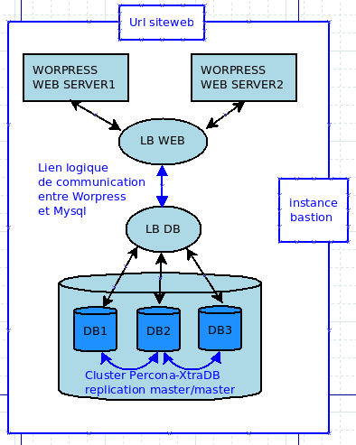

# 5 Minutes Stacks, épisode XX : Wordpress HA  #

## Episode XX : Wordpress HA

Birth of CMS in his its version 0.7, it is an open source software b2 created by Michel Valdrighi in 2001, it is written in PHP and rests(bases) on a database MySQL. It is above all an engine(a mainspring) of blog.
Wordpress is thus a software of the family of the management systems of contents or still CMS (Satisfied Management System). CMS WORDPRESS allows at the same time to save time of development at the level of the creation of your web site and to add it easily pages, Wordpress thus allows to create dynamic sites.
Wordpress premet in users to manage themselves their Web site thanks to a very clear management console, the profusion of the menus and its possibilities regarding configuration can put off the users most greenhorns

## Descriptions

The stack " WordpressHA " allows to set up one architecture to High application availability. It creates two authorities carrying the application servers Apache loadbalancer in ROUND_ROBIN by using the feature LBAAS (Loadbalancer have as service) of openstack, as well as awaring)az cluster Mysql with real replication in real-time, synchronized thanks to the solution PerconaXtraDB and constituted of three nodes also using the feature LBAAS. And finally an authority serving as bastion to connect in the various machines of the stack.

## Preparations

### Les versions
 - Wordpress 4.5.2
 - Percona-xtraDB
 - Apache
 - Php5

### The prerequisites to deploy this stack

 * an internet access
 * a Linux shell
 * a [Cloudwatt account](https://www.cloudwatt.com/cockpit/#/create-contact), with an [existing keypair](https://console.cloudwatt.com/project/access_and_security/?tab=access_security_tabs__keypairs_tab)
 * the tools [OpenStack CLI](http://docs.openstack.org/cli-reference/content/install_clients.html)
 * a local clone of the git repository [Cloudwatt applications](https://github.com/cloudwatt/applications)

### Size of the instance

 Per default, the script is proposing a deployement on an instance type "Standard 2" (n2.cw.standard-2).  Instances are charged by the minute and capped at their monthly price (you can find more details on the [Tarifs page](https://www.cloudwatt.com/fr/produits/tarifs.html) on the Cloudwatt website). Obviously, you can adjust the stack parameters, particularly its defaut size.

## What will you find in the repository

 Once you have cloned the github, you will find in the `bundle-coreos-cassandra/` repository:

 * `bundle-coreos-cassandra.heat.yml`: HEAT orchestration template. It will be used to deploy the necessary infrastructure.
 * `stack-start.sh`: Stack launching script. This is a small script that will save you some copy-paste.

## Start-up

### Initialize the environment

 Have your Cloudwatt credentials in hand and click [HERE](https://console.cloudwatt.com/project/access_and_security/api_access/openrc/).
 If you are not logged in yet, you will go thru the authentication screen then the script download will start. Thanks to it, you will be able to initiate the shell accesses towards the Cloudwatt APIs.

 Source the downloaded file in your shell. Your password will be requested.

 ~~~ bash
 $ source COMPUTE-[...]-openrc.sh
 Please enter your OpenStack Password:

 ~~~

 Once this done, the Openstack command line tools can interact with your Cloudwatt user account.

### Adjust the parameters

 With the `bundle-coreos-cassandra.heat.yml` file, you will find at the top a section named `parameters`. The sole mandatory parameter to adjust is the one called `keypair_name`. Its `default` value must contain a valid keypair with regards to your Cloudwatt user account. This is within this same file that you can adjust the instance size by playing with the `flavor_name` parameter.

~~~ yaml

heat_template_version: 2013-05-23

parameters:
  image:
    type: string
    description: Glance Image
    default: "Ubuntu 14.04"

  flavor:
    type: string
    description: Flavor
    default: n2.cw.standard-2

  keypair_name:
    type: string
    description: SSH key
    default: mickael

  public_net_id:
    type: string
    description: Public network ID
    default: 6ea98324-0f14-49f6-97c0-885d1b8dc517

  themysqlpwd:
    description: Basic auth password for mysql users
    label: Mysql Auth password
    type: string
    hidden: true
    constraints:
      - length: { min: 6, max: 24 }
        description: Password must be between 6 and 24 characters

[...]
~~~

Par défaut, les ports utilisés par Wordpress, Mysql et Percona-xtraDB ne sont accessibles que sur le réseau local, si vous souhaitez changer ces règles de filtrage (pour ouvrir par exemple le port 3306), vous pouvez également éditer le fichier `bundle-trusty-Wordpressfr1.heat.yml`.

~~~ yaml
security_group:
  type: OS::Neutron::SecurityGroup
  properties:
    rules:
      - { direction: ingress, protocol: TCP, port_range_min: 22, port_range_max: 22 }
      - { direction: ingress, protocol: TCP, port_range_min: 80, port_range_max: 80 }
      - { direction: ingress, protocol: TCP, port_range_min: 443, port_range_max: 443 }
      - { direction: ingress, protocol: ICMP }
      - { direction: egress, protocol: TCP, port_range_min: 80, port_range_max: 80 }
      - { direction: egress, protocol: ICMP }
      - { direction: egress, protocol: TCP }
      - { direction: egress, protocol: UDP }
~~~

Start the stack

In a shell, launch the  script `stack-start.sh`:

~~~
./stack-start.sh nom\_de\_votre\_stack
~~~

Exemple :

~~~bash
$ ./stack-start.sh Wordpress
+--------------------------------------+-----------------+--------------------+----------------------+
| id                                   | stack_name      | stack_status       | creation_time        |
+--------------------------------------+-----------------+--------------------+----------------------+
| ee873a3a-a306-4127-8647-4bc80469cec4 |    Wordpress    | CREATE_IN_PROGRESS | 2015-11-25T11:03:51Z |
+--------------------------------------+-----------------+--------------------+----------------------+
~~~

Then wait **5 minutes** than the deployement have been completed .

 ~~~ bash
 $ watch -n 1 heat stack-list
 +--------------------------------------+------------+-----------------+----------------------+
 | id                                   | stack_name | stack_status    | creation_time        |
 +--------------------------------------+------------+-----------------+----------------------+
 | xixixx-xixxi-ixixi-xiixxxi-ixxxixixi | Wordpress  | CREATE_COMPLETE | 2025-10-23T07:27:69Z |
 +--------------------------------------+------------+-----------------+----------------------+
 ~~~
 ### All of this is fine, but you do not have a way to run the stack through the console ?

 Yes ! Using the console, you can deploy an OpenVPN server:
 1.	Go the Cloudwatt Github in the applications/bundle-trusty-lamp repository
 2.	Click on the file nammed bundle-trusty-lamp.heat.yml
 3.	Click on RAW, a web page appear with the script details
 4.	Save as its content on your PC. You can use the default name proposed by your browser (just remove the .txt)
 5.  Go to the « [Stacks](https://console.cloudwatt.com/project/stacks/) » section of the console
 6.	Click on « Launch stack », then click on « Template file » and select the file you've just saved on your PC, then click on « NEXT »
 7.	Named your stack in the « Stack name » field
 8.	Enter your keypair in the « keypair_name » field
 9. Enter your Mysql password in the field « themysqlpwd »

 Le script `start-stack.sh` handles launch the necessary calls to the API Cloudwatt :

 * Start 6 instances based on Ubnuntu , pre- provisioned with the OpenVPN stack.
 * Configure 6 nodes a bastion instance 3 Mysql server and 2 Web server.
 * Mount the cluster Mysql using the three nodes.

### Enjoy

Once this is done you have VPN tunnel between two remote website ready to use, you can retrieve the IP (public and private), subnets, networks, associated with instances created with the following command (Section `outputs` list the outputs of the stack)

You can view the stack output parameters in the console
by clicking: Stack → name of your stack → The Overview tab

Les outputs de la stack sont :
- wp_floating_url ( site web url )
- sql_vip( mysql instances's private ip )
- web_vip ( web instances's private ip )
- server_id ( id of the instance vpn server Wordpress and Mysql )
- first_address ( bastion instances's public ip )

~~~ bash
$ heat stack-show Wordpress
+-----------------------+---------------------------------------------------+
| Property              | Value                                             |
+-----------------------+---------------------------------------------------+
|                     [...]                                                 |
| outputs               | [                                                 |
|                       |   {                                               |
|                       |     "output_value": "10.0.1.100",                 |
|                       |     "description": "server3 private IP address",  |
|                       |     "output_key": "server3_private_ip"            |
|                       |   },                                              |
|                       |   {                                               |
|                       |     "output_value": "10.0.1.102",                 |
|                       |     "description": "server1 private IP address",  |
|                       |     "output_key": "server1_private_ip"            |
|                       |   },                                              |
|                       |   {                                               |
|                       |     "output_value": "XX.XX.XX.XX",                |
|                       |     "description": "server3 public IP address",   |
|                       |     "output_key": "server3_public_ip"             |
|                       |   },                                              |
|                       |   {                                               |
|                       |     "output_value": "YY.YY.YY.YY",                |
|                       |     "description": "server1 public IP address",   |
|                       |     "output_key": "server1_public_ip"             |
|                       |   },                                              |
|                       |   {                                               |
|                       |     "output_value": "10.0.1.103",                 |
|                       |     "description": "server2 private IP address",  |
|                       |     "output_key": "server2_private_ip"            |
|                       |   },                                              |
|                       |   {                                               |
|                       |     "output_value": "ZZ.ZZ.ZZ.ZZ",                |
|                       |     "description": "server2 public IP address",   |
|                       |     "output_key": "server2_public_ip"             |
|                       |   }                                               |
|                       | ]                                                 |
|                     [...]                                                 |
+-----------------------+---------------------------------------------------+
~~~

### Administer le serveur  Wordpress

~~~ bash
ssh -i <keypair> cloud@<node-ip@>

~~~

### Consulter les logs de Wordpress

 Wordpress services logs are visible via command line

~~~ bash
ssh -i <keypair> core@<node-ip@>

~~~

Wordpress  backup its logs in files `/var/log/syslog` et `/var/log/apache2/error.log`
Mysql backup its logs in files  `/var/log/syslog` et `/var/log/mysql/error.log`

~~~ bash
ssh -i <keypair> cloud@<node-ip@>
tail -n 100 /var/log/Wordpress.log
grep VPN /var/log/syslog
~~~

### Les fichiers importants sont :

#### pour les Webserver:

- `/var/www/wordpress/wp-config.php`: Configuration files of the remote connexion to Cluster Mysql
- `/etc/apache2/sites-available/000-default.conf`: Configuration files of the Virtualhost Wordpress

#### pour les Mysqlserver:

- `/etc/mysql/conf.d/galera.cnf`: Galera's Configuration files
- `/etc/mysql/my.cnf`:  Mysql's Configuration files

#### Autres sources pouvant vous intéresser:

* [Wordpress Homepage](https://fr.wordpress.org/)
* [PerconaHomepage](https://www.percona.com/)
* To connect yourself via ssh to the  various instances of the stack via the bastion you have to upload your key ssh on this one before.

-----
Have fun. Hack in peace.
